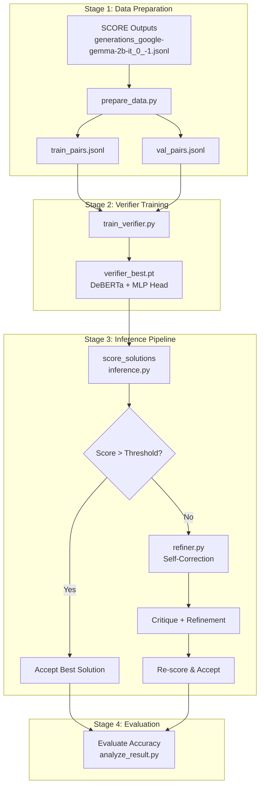

# Contrastive Verifier Codebase Documentation

A system that implements **Contrastive Verifier Training** for ranking and refining LLM-generated mathematical reasoning chains on GSM8K dataset.

---

## Overview

This codebase implements a **two-stage approach** to improve LLM reasoning accuracy:

1. **Contrastive Verifier Training**: Train a small encoder model (DeBERTa-v3-base) to rank reasoning chains using contrastive pairs (correct vs. incorrect solutions)
2. **Self-Correction Refinement**: Use a generative LLM (Gemma 2-2B) to critique and refine low-confidence solutions identified by the verifier



---

## Methodology

### Contrastive Pair Construction

For each question with multiple generated solutions:

1. **Identify correctness** by comparing `\boxed{answer}` against ground truth `#### answer`
2. **Construct pairs**: Each correct solution paired with each incorrect solution
3. **Label**: `label=1` means solution_a is better than solution_b

> [!IMPORTANT]
> Max 10 pairs per question prevents questions with many solutions from dominating.

### Verifier Architecture


**Training Objective**: Margin Ranking Loss
```
loss = max(0, margin - (score_correct - score_incorrect))
```

### Self-Correction Pipeline

For low-confidence solutions (score < threshold):
1. **Critique Generation** → LLM identifies errors
2. **Refinement Generation** → LLM produces corrected solution

---

## File Documentation

### Core Pipeline

| File | Purpose |
|------|---------|
| [prepare_data.py](file:///Users/sulaiman/Downloads/contrastive_verifier/prepare_data.py) | Creates contrastive pairs from SCORE outputs |
| [train_verifier.py](file:///Users/sulaiman/Downloads/contrastive_verifier/train_verifier.py) | Trains DeBERTa-based verifier model |
| [inference.py](file:///Users/sulaiman/Downloads/contrastive_verifier/inference.py) | Scores solutions using trained verifier |
| [refiner.py](file:///Users/sulaiman/Downloads/contrastive_verifier/refiner.py) | Self-correction using Gemma 2-2B |

### Integrated Pipelines

| File | Purpose |
|------|---------|
| [integrated_pipeline.py](file:///Users/sulaiman/Downloads/contrastive_verifier/integrated_pipeline.py) | Complete pipeline for multi-solution scenarios |
| [single_solution_pipeline.py](file:///Users/sulaiman/Downloads/contrastive_verifier/single_solution_pipeline.py) | Single-solution with verifier-guided self-correction |

### Test Evaluation Chain

| File | Input | Output |
|------|-------|--------|
| [generate_test_solutions.py](file:///Users/sulaiman/Downloads/contrastive_verifier/generate_test_solutions.py) | Test questions | 5 solutions/question |
| [score_test_solutions.py](file:///Users/sulaiman/Downloads/contrastive_verifier/score_test_solutions.py) | Generated solutions | Scored solutions |
| [refine_test_solutions.py](file:///Users/sulaiman/Downloads/contrastive_verifier/refine_test_solutions.py) | Scored solutions | Refined results |
| [evaluate_test_results.py](file:///Users/sulaiman/Downloads/contrastive_verifier/evaluate_test_results.py) | Refined results | Accuracy metrics |

### Analysis Scripts

| File | Purpose |
|------|---------|
| [analyze_result.py](file:///Users/sulaiman/Downloads/contrastive_verifier/analyze_result.py) | Verifier performance analysis |
| [comparison.py](file:///Users/sulaiman/Downloads/contrastive_verifier/comparison.py) | Compare selection strategies |
| [evaluate_refinement.py](file:///Users/sulaiman/Downloads/contrastive_verifier/evaluate_refinement.py) | Evaluate refinement impact |
| [evaluate_single_solution.py](file:///Users/sulaiman/Downloads/contrastive_verifier/evaluate_single_solution.py) | Single-solution evaluation |

### Utilities

| File | Purpose |
|------|---------|
| [check_data_source.py](file:///Users/sulaiman/Downloads/contrastive_verifier/check_data_source.py) | Verify train/test data leakage |
| [inspect_refinement.py](file:///Users/sulaiman/Downloads/contrastive_verifier/inspect_refinement.py) | Show example refinement cases |

---

## Key Components

### `prepare_data.py`

**Functions**:
- `extract_boxed_answer(text)` - Extracts answer from `\boxed{}`
- `extract_final_answer(answer_text)` - Extracts ground truth from `#### answer`
- `normalize_answer(ans)` - Removes formatting ($, %, commas)
- `check_correctness(generated, ground_truth)` - Compares normalized answers
- `create_contrastive_pairs()` - Main function creating train/val splits

**Output Format**:
```json
{
  "question": "John has 5 apples...",
  "solution_a": "Step 1: ... \\boxed{3}",
  "solution_b": "Step 1: ... \\boxed{7}",
  "label": 1
}
```

---

### `train_verifier.py`

**Classes**:
- `ContrastivePairDataset` - Loads and tokenizes pairs
- `VerifierModel` - DeBERTa encoder + MLP scorer

**Training Config**:
| Parameter | Value |
|-----------|-------|
| Model | microsoft/deberta-v3-base |
| Batch Size | 16 |
| Epochs | 3 |
| Learning Rate | 2e-5 |
| Margin | 0.5 |

---

### `refiner.py`

**Class**: `SelfCorrectionRefiner`

**Methods**:
- `generate_critique(question, solution)` → Analyzes errors
- `generate_refinement(question, original_solution, critique)` → Produces fix
- `refine_solution(question, solution)` → Combined workflow

---

## Data Files

| File | Size | Description |
|------|------|-------------|
| `generations_google-gemma-2b-it_0_-1.jsonl` | ~38.8MB | SCORE-generated solutions |
| `train_pairs.jsonl` | ~27.7MB | Training contrastive pairs |
| `val_pairs.jsonl` | ~3MB | Validation pairs |
| `scored_outputs.jsonl` | ~44.7MB | Solutions with verifier scores |
| `verifier_best.pt` | ~438MB | Trained verifier checkpoint |

---

## Execution Order

```bash
# 1. Prepare contrastive pairs
python prepare_data.py

# 2. Train verifier
python train_verifier.py

# 3. Score solutions
python inference.py

# 4. Analyze results
python analyze_result.py
python comparison.py

# 5. Run refinement pipeline (optional)
python integrated_pipeline.py
python evaluate_refinement.py
```

---

## Expected Results

- **Verifier selection** outperforms random by ~15-30%
- **Score separation** (correct - incorrect) > 0.1
- **Self-correction** provides +3-5% accuracy gain on low-confidence solutions
